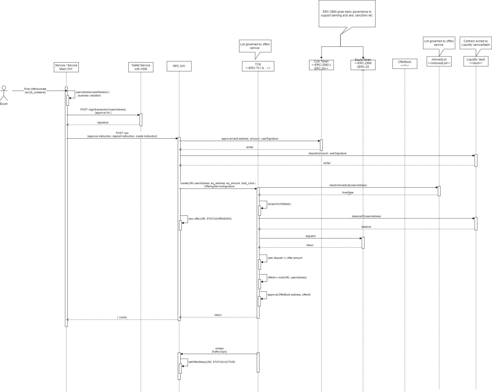
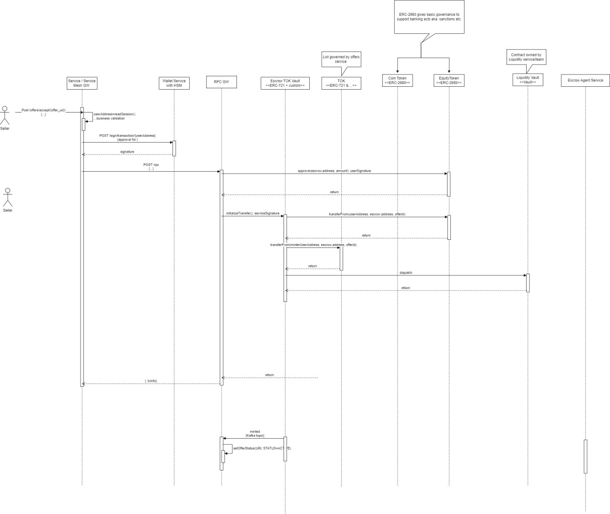

AssetLink Nexus
===============

Welcome to **AssetLink Nexus**, the pioneering solution for the first tokenized company in Poland. This initiative aims to redefine financial asset management and user experience, marking a significant leap forward from traditional systems like those used by PKO BP.

Overview
--------

AssetLink Nexus introduces a novel approach to asset management, optimizing the use of funds and enhancing user experiences through blockchain technology.

Problem
-------

The current PKO BP system locks in funds that could otherwise be productive, leading to inefficiencies and lost revenue opportunities.

Solution
--------

AssetLink Nexus proposes a three-step improvement process: 1. **Liquid Pool**: Utilizes smart contracts for comprehensive asset management. 2. **Overnight Funds**: Ensures locked-in funds are productive, generating revenue. 3. **Enhanced User Experience**: Offers cost-free transactions, boosting client satisfaction.

Benefits
--------

*   Reduced need for fund locking.
*   Productive use of funds with real overnight rates.
*   Improved user experience through cost-free trades.

Tokenization Impact
-------------------

*   Aims for 20% asset tokenization, enhancing market coverage for IPOs.
*   Forefront of tokenization in Poland.

Roadmap
-------

*   [x] Vault – Liquid pool for multiple bids.
*   [x] First-come, first-served bid fulfillment.
*   [ ] Development of Flash Loans.
*   [ ] Liquidity Provision for cash flow assets.

Market Potential
----------------

*   Targeting a significant share of the 1.128 billion PLN market.
*   Leverage first-mover advantage for market dominance.

Competition and Use Cases
-------------------------

*   Unique deployment of smart contracts at scale.
*   Integration with Ethereum for enhanced security.
*   Liquid staking for feeless stock trading.

Proposed changes
-------
During the hackathon we identified large scope for contract improvements, during the discovery we started planning an more efficient way to archive business goals for example:

Create offer variant A:

Approve offer for variant A:

Contact
-------

Connect with us through DegenHouse for more information or collaboration opportunities.

* * *

This project is not just a submission for the Degen Hack but also a step towards improving the SIRA system from PKO BP. We are excited to lead the way in Poland's financial sector with AssetLink Nexus.